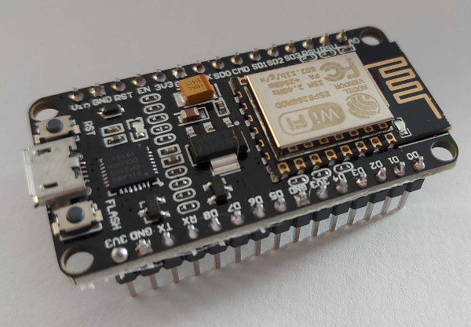

While not strictly an arduino, these development boards operate and are used very similarly.

## Brief overview of the NodeMCU ESP8266

Let's unpack that name before anything else:
1. NodeMCU - an open-source firmware written in [Lua](https://www.lua.org/about.html) for the ESP8266.
2. ESP8266 - a low-cost wifi microchip produced by [Espressif Systems](https://www.espressif.com/en/products/modules/esp8266), these can be purchased stand-alone or as part of a development board.

The term _NodeMCU ESP8266_ is often used to refer to the development boards and while these development boards are not technically arduino's, but they are arduino-like and are supported by the arduino IDE.

### Pins

Looking at the top of the board with the USB port pointing down:

|Description|Pin Label|BOARD|Pin Label|Description|
|-:|-|-|-:|-|
|*ADC0* TOUT|**A0**| |**D0**|*GPIO16* User, Wake   (r/w only, no interrupt)|
|*Reserved*|**RSV**||**D1**|*GPIO5*|
|*Reserved*|**RSV**||**D2**|*GPIO4*|
|*GPIO10* SDD3|**SD3**||**D3**|*GPIO0* FLASH|
|*GPIO09* SDD2|**SD2**||**D4**|*GPIO02* TXD1|
|*MOSI* SDD1|**SD1**| |**3V3**|*3.3 Volt*|
|*CS* SDCMD|**CMD**| |**GND**|*Ground*|
|*MISO* SDD0|**SD0**| |**D5**|*GPIO14* HSCLK|
|*SCLK* SDCLK|**CLK**| |**D6**|*GPIO12* HMISO|
|*Ground*|**GND**| |**D7**|*GPIO13* RXD2 HMOSI|
|*3.3 Volt*|**3V3**| |**D8**|*GPIO15* TXD2 HCS|
|*EN*|**EN**| |**D9**|*GPIO3* RXDO|
|*RST*|**RST**| |**D10**|*GPI01* TXD0|
|*Ground*|**GND**| |**GND**|*Ground*|
|*VIN 5 Volt*|**VIN**| |**3V3**|*3.3 Volt*|

#### Available GPIO Pins

The NodeMCU ESP8266 12-E has thirteen (13) General Purpose Input/Output (GPIO) pins exposed on the board, however not all of these pins are suggested for use.

Refer to [https://randomnerdtutorials.com/esp8266-pinout-reference-gpios/](https://randomnerdtutorials.com/esp8266-pinout-reference-gpios/) for a great write-up on the pins.

##### Safely usable GPIO Pins

Some of the GPIO pins have multiple uses or can have unexpected behaviour at boot, the following pins are generally considered safe for both Input and Output:
- D1 (GPIO5)
- D2 (GPIO4)
- D5 (GPIO14)
- D6 (GPIO12)
- D7 (GPIO13)

#### Analog Pins

The NodeMCU has one (1) Analog pin available (A0/ADC0).

### Sensors

Arduino sensors can be used.

If the sensor requires 5v of power you can use the VIN pin to power it but you will need to use a voltage divider if the sensor returns more than 3.3v to prevent frying your board.

## Development Tools

### Arduino IDE

Good step-by-step guide to installing the Arduino IDE and the ESP8266 modules: [https://microcontrollerslab.com/how-to-install-esp8266-board-arduino-ide/](https://microcontrollerslab.com/how-to-install-esp8266-board-arduino-ide/)

If you're looking for custom logic or just want to write the code yourself the arduino IDE is solid and works well with the ESP8266.

### Tasmotizer

I'm a big fan of [Tasmotizer](https://github.com/tasmota/tasmotizer) for quickly configuring the ESP8266 boards for use with [MQTT](https://mqtt.org/). 

Since I'm mostly building simple sensors to integrate with [Home Assistant](https://www.home-assistant.io/) using MQTT, Tasmotizer saves me a lot of time.

