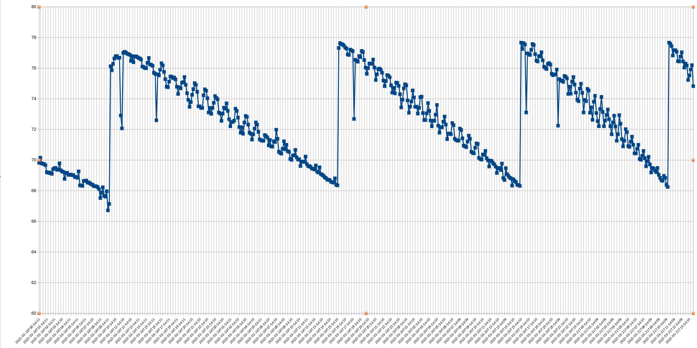

# Example markdown 

In this test, the files included via relative links don't exist (wrong path).

## Lists

### Ordered List

1. This is the first top-level item in an ordered list
   1. Item 2 is indented, one level in
      1. Item 3 is indented, two levels in
            1. Item 4 is indented, four levels in
   2. Item 5 is one level in
2. This is the second top-level item

### Unordered List

- This is the first top-level item in an unordered list
  - Item 2 is indented, one level in
    - Item 3 is indented, two levels in
        - Item 4 is indented, four levels in
  - Item 5 is one level in
- This is the second top-level item

### Mixed List

1. This is the first top-level item in a mixed list
   - Item 2 is indented, one level in
     1. Item 3 is indented, two levels in
           1. Item 4 is indented, four levels in
     - Item 5 is two levels in
- This is the second top-level item

## Code Block

```text

This is a code block.
This is the second line of a code block.
This is the third line of a code block.

This is the last line of a code block.
```

## Inline Code

`This is inline code`


## Links

1. This is [an example](http://example.com/ "This is a title attribute") inline link.
1. [This link](http://example.com/) has no title attribute.
1. [More than one](http://example.com/) link [on a line](https://example.org)


## Remote Images


## Local Images

Local images are added to an attachments list so they can be uploaded.




## Relative Links (local, requires attachment)

[attachment.txt](./attachment.txt)

## Text styling

- *Italic*
- **Bold**


## Tables

| | Column 1 | Column 2 | Column 3 | Column 4 |
|-| - | - | - | - |
|Row 1| 1.1 | 1.2 | 1.3 | 1.4 |
|Row 2| 2.1 | 2.2 | 2.3 | 2.4 |
|Row 3| 3.1 | 3.2 | 3.3 | 3.4 |
|Row 4| 4.1 | 4.2 | 4.3 | 4.4 |


---


# h1

H1 example

## h2

H2 example

### h3

H3 example

#### h4

H4 example

##### h5

H5 example

###### h6

H6 example

